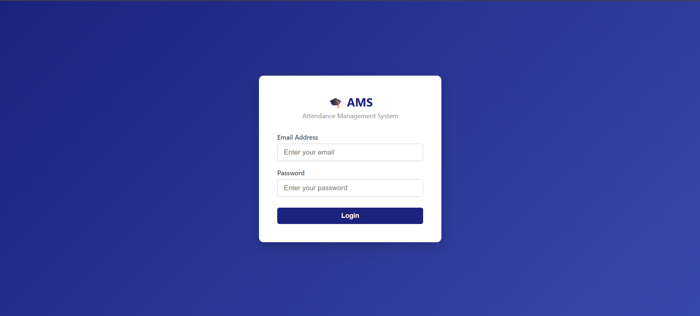
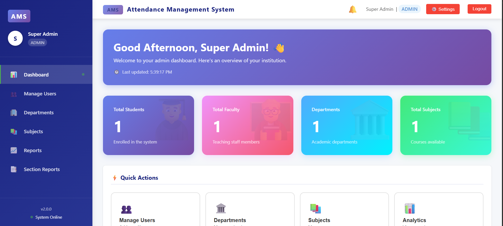
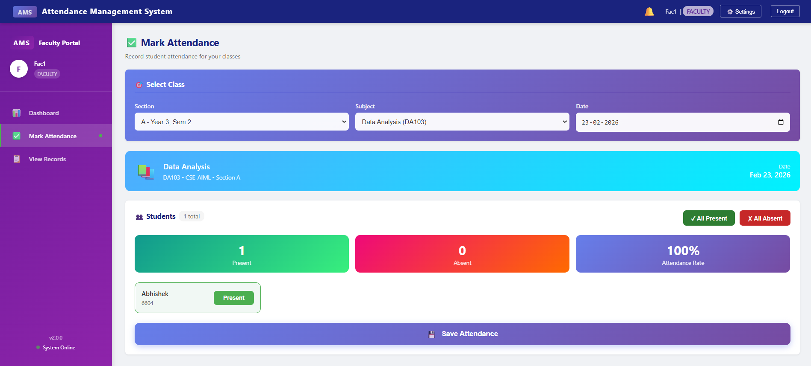
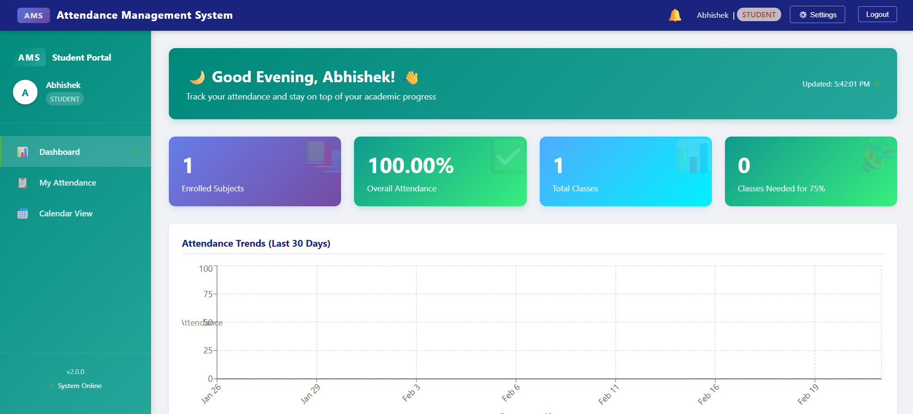

# 🎓 Attendance Management System

A full-stack web application built using the MERN stack to automate and streamline attendance tracking with real-time synchronization and role-based access control.


## 🔗 Links 

- **Live Demo:** [https://attendance-system-pi-jade.vercel.app/](https://attendance-system-pi-jade.vercel.app/)
- **Backend API:** [https://attendance-system-re26.onrender.com/](https://attendance-system-re26.onrender.com/)
- **GitHub:** [https://github.com/Abhishek13501/attendance-management-system](https://github.com/Abhishek13501/attendance-management-system)

---

## ✨ Key Features

### Admin Portal
- Complete user management (CRUD operations for students and faculty)
- Department, section, and subject management
- System-wide analytics and attendance reports
- Password reset functionality for all users
- Real-time dashboard with live statistics

### Faculty Portal
- Mark attendance for assigned subjects with real-time updates
- View and filter attendance records by date, subject, and section
- Export attendance data to Excel
- Subject-wise student management

### Student Portal
- Personal attendance tracking with percentage calculations
- Subject-wise attendance breakdown with visual charts
- Calendar view of attendance history
- Low attendance alerts and insights
- Detailed analytics with trend visualization

### Core Features
- **Real-time Updates:** Socket.io integration for instant data synchronization
- **Responsive Design:** Mobile-first UI that works on all devices
- **Secure Authentication:** JWT-based auth with role-based access control
- **Data Export:** Excel report generation for attendance records
- **Audit Logging:** Track all system changes and user actions

---

## 🛠️ Tech Stack

**Frontend:**
- React 18.2 with React Router for SPA navigation
- Recharts for data visualization
- Socket.io Client for real-time communication
- Axios for API requests
- Context API for state management

**Backend:**
- Node.js with Express.js framework
- MongoDB with Mongoose ODM
- Indexed MongoDB collections for optimized query performance
- Socket.io for WebSocket connections
- JWT for authentication
- bcryptjs for password hashing
- ExcelJS for report generation

**Architecture:**
- RESTful API with client-server separation and JWT-based stateless authentication

---

## 📁 Project Structure

```
attendance-management-system/
├── backend/
│   ├── controllers/        # Business logic (auth, admin, faculty, student)
│   ├── models/            # MongoDB schemas (User, Attendance, Department, etc.)
│   ├── routes/            # API endpoints
│   ├── middleware/        # Auth & audit middleware
│   ├── config/            # Configuration files
│   ├── seed.js            # Database seeding script
│   └── server.js          # Entry point
├── frontend/
│   ├── src/
│   │   ├── components/    # Reusable UI components (Navbar, Sidebar, etc.)
│   │   ├── context/       # Auth & Socket context providers
│   │   ├── pages/         # Role-based pages (admin, faculty, student)
│   │   ├── utils/         # API utilities
│   │   ├── App.jsx        # Main app component
│   │   └── index.js       # Entry point
│   └── public/
└── README.md
```

---

## 🚀 Installation & Setup

### Prerequisites
- Node.js (v14+)
- MongoDB (local or Atlas)
- npm or yarn

### 1. Clone Repository
```bash
git clone https://github.com/Abhishek13501/attendance-management-system.git
cd attendance-management-system
```

### 2. Backend Setup
```bash
cd backend
npm install
```

Create `.env` file:
```env
NODE_ENV=development
PORT=5000
MONGODB_URI=mongodb://localhost:27017/attendance-system
JWT_SECRET=your_jwt_secret_key_min_32_chars
FRONTEND_URL=http://localhost:3000
```

### 3. Frontend Setup
```bash
cd frontend
npm install
```

Create `.env` file:
```env
REACT_APP_API_URL=http://localhost:5000/api
```

### 4. Seed Database (Optional)
```bash
cd backend
node seed.js
```

### 5. Run Application

**Backend:**
```bash
cd backend
npm start
```

**Frontend:**
```bash
cd frontend
npm start
```

Application runs on `http://localhost:3000`

---

## 👥 User Roles & Access

| Role    | Default Email       | Default Password | Capabilities |
|---------|-------------------|------------------|--------------|
| Admin   | admin@ams.com     | admin123         | Full system access, user management, reports |
| Faculty | faculty@ams.com   | faculty123       | Mark attendance, view records, export data |
| Student | student@ams.com   | student123       | View personal attendance, analytics |

⚠️ **Note:** These are demo credentials created using seed data. Change passwords before deploying to production.

---

## 📡 API Endpoints

### Authentication
```
POST   /api/auth/login              - User login
GET    /api/auth/me                 - Get current user
PUT    /api/auth/change-password    - Change password
```

### Admin Routes
```
GET    /api/admin/users             - List all users
POST   /api/admin/users             - Create new user
PUT    /api/admin/users/:id         - Update user
DELETE /api/admin/users/:id         - Delete user and associated attendance records
PUT    /api/admin/users/:id/reset-password - Reset user password

GET    /api/admin/departments       - Manage departments
GET    /api/admin/sections          - Manage sections
GET    /api/admin/subjects          - Manage subjects
GET    /api/admin/dashboard         - Dashboard statistics
```

### Faculty Routes
```
GET    /api/faculty/subjects        - Get assigned subjects
GET    /api/faculty/students        - Get students by subject/section
POST   /api/faculty/attendance      - Mark attendance
GET    /api/faculty/attendance      - View attendance records
```

### Student Routes
```
GET    /api/student/attendance                - Get all records
GET    /api/student/attendance/percentage     - Subject-wise percentage
GET    /api/student/attendance/trends         - 30-day trends
GET    /api/student/attendance/insights       - Low attendance alerts
GET    /api/student/attendance/calendar       - Calendar view data
GET    /api/student/attendance/export         - Export to Excel
```

---

## 🔐 Security Features

- JWT-based authentication with HTTP-only cookies
- Password hashing using bcrypt (10 rounds)
- Role-based access control (RBAC) middleware
- Protected API routes with token verification
- CORS configuration for cross-origin requests
- Input validation and sanitization
- Cascade delete to maintain data integrity
- Audit logging for critical operations

---

## 🚀 Deployment

### Recommended Stack
- **Frontend:** Vercel / Netlify
- **Backend:** Render / Railway
- **Database:** MongoDB Atlas (Free tier available)

### Production Environment Variables

**Backend:**
```env
NODE_ENV=production
MONGODB_URI=<your_mongodb_atlas_uri>
JWT_SECRET=<strong_random_string>
FRONTEND_URL=<your_frontend_url>
```

**Frontend:**
```env
REACT_APP_API_URL=<your_backend_url>/api
```

---

## 📸 Screenshots

### Login Page


### Admin Dashboard


### Faculty Attendance Marking


### Student Dashboard


---

## 👨‍💻 Developer

**Abhishek Kethepally**
- GitHub: [@Abhishek13501](https://github.com/Abhishek13501)
- LinkedIn: [Abhishek Kethepally](https://www.linkedin.com/in/abhishek-kethepally-435440330/)
- Email: Kethepallyabhishek123@gmail.com

---

## 📌 Resume Description

Built a full-stack Attendance Management System using the MERN stack with role-based authentication and real-time updates via Socket.io. Designed secure RESTful APIs with JWT-based authorization and implemented Excel report export with optimized MongoDB queries.

---

**Built with React, Node.js, MongoDB, and Socket.io**
